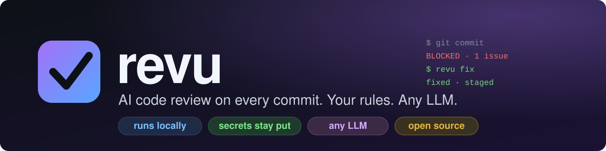
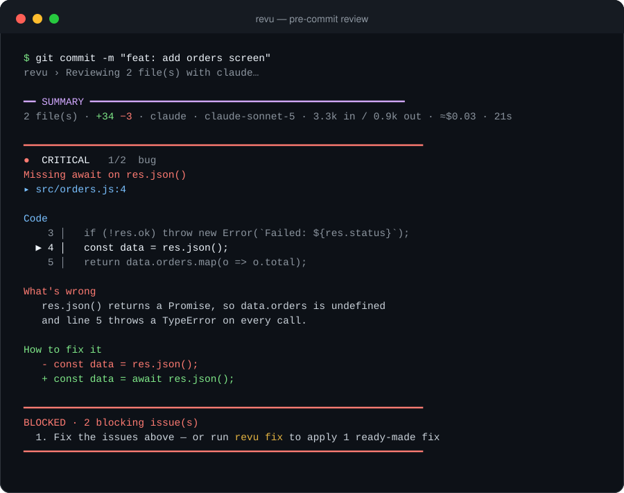

<div align="center">



<br>

[](https://github.com/lzadev/revu/actions/workflows/ci.yml)
[](LICENSE)
[](https://nodejs.org)
[](#project-status)
[](CONTRIBUTING.md)

**A code review that runs on your machine, on every `git commit`, before your code leaves it.**<br>
Your team's rules. Your choice of LLM: your Claude subscription, an API key, or a model running locally.

[Quick start](#quick-start) ·
[Documentation](docs/README.md) ·
[Security](SECURITY.md) ·
[Contributing](CONTRIBUTING.md)

</div>

<br>

<p align="center">
  
</p>

## Table of contents

- [Why revu](#why-revu)
- [Features](#features)
- [Quick start](#quick-start)
- [How it works](#how-it-works)
- [Your rules](#your-rules)
- [Choose your LLM](#choose-your-llm)
- [Commands](#commands)
- [AI agents and CI](#ai-agents-and-ci)
- [Security and privacy](#security-and-privacy)
- [Cost](#cost)
- [Project status](#project-status)
- [Documentation](#documentation)
- [Contributing](#contributing)
- [License and acknowledgements](#license-and-acknowledgements)

## Why revu

Hosted review bots look at your code after you push it, and you cannot easily bring your own rules or your own model.
`revu` moves the review to the one moment where fixing a problem is cheapest: **the commit**.

- **Local first.** It runs as a git hook. Nothing has to be pushed anywhere for you to get feedback.
- **Your rules, in plain language.** Point it at the `AGENTS.md` you already have, or write a short `.revu.yaml`. No syntax to learn.
- **Any LLM.** Claude through your subscription, the Anthropic or any OpenAI-compatible API, or Ollama and LM Studio on your own hardware.
- **Secrets never leave.** They are detected locally with 225 rules, and a file that holds one is not sent to any model at all.
- **Built for agents too.** When an AI agent commits, revu gives it precise feedback and a `revu fix` command to apply the fixes.
- **Honest about itself.** A benchmark command scores any model on planted bugs so you can see what a model really catches.

## Features

| | |
|---|---|
| **Review on commit** | Reads the staged diff, reports problems with the code, why it is wrong and a fix you can apply with one key |
| **Rules from your project** | Auto-discovers `AGENTS.md`, `CLAUDE.md`, `.cursorrules`, `.github/copilot-instructions.md`, `.revu/rules/*.md`; per-folder rules for monorepos |
| **Secret protection** | 225 detection rules (the gitleaks set plus revu's own), multi-line keys, a gate that aborts any request that still contains a secret, and a local audit log |
| **Fix loop for agents** | `revu fix` applies ready-made fixes non-interactively and refuses risky ones; CI-friendly `--json` output |
| **Safe by design** | A repository cannot run commands or redirect your API key; suggestions that add URLs or code execution are never auto-applied; every printed string is sanitized |
| **Measurable** | `revu bench` scores a model on 7 planted bugs and 2 clean files; every review shows the model, tokens and cost |
| **Predictable cost** | Per-review usage is reported; batches adapt to local context windows; repeated diffs are cached |

## Quick start

**Requirements:** Node.js 20 or newer and git. macOS is the tested platform; see [Project status](#project-status).

```sh
# 1. Install (from source, for now)
git clone https://github.com/lzadev/revu.git
cd revu && npm install && npm link

# 2. Turn it on in any git repository
cd your-project
revu init            # detects your LLM, creates .revu.yaml, installs the git hook

# 3. Check that everything works
revu doctor          # tests the LLM connection and shows which model answers
revu rules           # shows which rule files it is reading

# 4. Commit as usual
git add . && git commit -m "feat: add orders screen"
```

Nothing is published to npm yet. `revu init --yes --provider claude` sets a project up without questions, which is handy for
onboarding a team. More in [Getting started](docs/getting-started.md).

## How it works

```
you type:      git commit -m "my change"
                     │
                     ▼
         git runs the pre-commit hook          ← installed once by `revu init`
                     │
                     ▼
   revu reads the staged diff
                     │
                     ├─ local checks (free): secrets, sensitive files, hidden Unicode
                     ├─ your rules: AGENTS.md, .revu.yaml, .revu/rules/
                     └─ your LLM reviews what is safe to send
                     │
                     ▼
   findings appear one by one: apply the fix, skip, ignore, or ask for more
                     │
                     ▼
   serious problem left?   YES → the commit is blocked     NO → the commit goes through
```

Three pieces: **the `revu` program** (installed once), **the rules** (in each repository, committed) and
**`.revu.local.yaml`** (which LLM *you* use; not committed). Every project has its own rules and every person can use a
different model.

## Your rules

Write them in plain language, in whichever style you prefer. revu merges them all.

| Style | Where | Good for |
|---|---|---|
| **Existing agent docs** | `AGENTS.md`, `CLAUDE.md`, `.cursorrules`, ... in the repo root | Zero setup: it just works |
| **One file** | `.revu.yaml` → `guidelines:` and `path_instructions:` | Small projects |
| **One file per topic** | `.revu/rules/*.md`, optionally scoped with `paths:` | Teams; reviewed like code |
| **Per folder** | `AGENTS.md` or `CLAUDE.md` inside a sub-folder | Monorepos |

```yaml
# .revu.yaml
guidelines: |
  - MUST: never commit secrets or tokens.
  - MUST: every async call handles its error.
  - React components in PascalCase; hooks prefixed with `use`.
path_instructions:
  - path: "supabase/**"
    instructions: "Every new table must have RLS enabled."
```

Write **`MUST:`** in front of anything that should block the commit. See exactly what is being read with `revu rules`.
Full guide: [Configuration and rules](docs/configuration.md).

## Choose your LLM

One line in `.revu.local.yaml` (created by `revu init`, not committed):

```yaml
provider: claude:sonnet
```

| To use | `provider:` | Notes |
|---|---|---|
| Your Claude subscription | `claude` or `claude:<model>` | No API key. `claude:sonnet`, `claude:opus`, `claude:haiku` or a model ID pins the model |
| Ollama (local, free) | `ollama:<model>` | Native API with a 16k context window; see the local model guide |
| LM Studio (local) | `lmstudio:<model>` | |
| Anthropic API | `anthropic:<model>` | `ANTHROPIC_API_KEY` |
| OpenAI or any compatible API | `openai:<model>`, `openrouter:<model>` | `OPENAI_API_KEY`, custom `base_url` |
| Any other program | `command:<your command>` | The prompt goes on stdin, the answer comes on stdout |

Every review prints which model answered and what it used, for example
`claude-sonnet-5 · 2.2k in / 1.0k out · ≈$0.019 · 9.1s`. **Measure before you trust a model:** `revu bench` scores it on
planted bugs. In our runs Claude Sonnet 5 found 7 of 7 while a 14B local model found 2 of 7, which is why the local model
guide exists. Details in [LLM providers](docs/providers.md).

## Commands

| Command | What it does |
|---|---|
| `revu` | Reviews what is staged (what the hook does). Handy to try things without committing |
| `revu init` | Sets up the repository: LLM, rules file, git hook |
| `revu doctor` | Checks configuration and tests the LLM connection |
| `revu rules` | Shows which rules are used and where they come from |
| `revu fix` | Applies the ready-made fixes of the last review (no menus; for agents and VS Code) |
| `revu bench` | Scores the configured LLM on planted bugs |
| `revu egress` | Shows what has been sent to an LLM (paths and sizes, never content) |
| `revu trust` | Approves a provider that a repository asks for (commands, custom URLs) |
| `revu --all` / `--base main` | Reviews all your changes, or a whole branch like a PR |
| `revu --json` / `--plain` | Machine-readable output for CI, or no menus |
| `revu --show-prompt` | Prints exactly what would be sent to the LLM, without calling it |

Skip a review in an emergency with `git commit --no-verify` or `REVU_SKIP=1`. All the details are in
[Daily use](docs/usage.md).

## AI agents and CI

When the committer is not a person at a terminal (Claude Code, Cursor, VS Code, CI, ...), there are no menus: revu prints the
full report, blocks the commit on serious problems, and ends with instructions for the agent. `revu fix` then applies the
ready-made fixes and lists what needs a manual change. To make the review mandatory for a team, run
`revu --base origin/main --json` in CI. See [AI agents, VS Code and CI](docs/agents-and-ci.md).

## Security and privacy

revu reads code and configuration you do not control, and an LLM's answer can end up in your files, so it is built as a tool
with an attack surface. [SECURITY.md](SECURITY.md) documents the threat model, the 16 flaws that were found and fixed (each with
a regression test) and the risks that remain. The essentials:

- A repository **cannot run commands or send your API key elsewhere**: such providers need your explicit `revu trust`.
- **Secrets do not leave your machine**: detected locally, the file is withheld from the model, and a final gate aborts any
  request that still looks like it holds one. With the LLM down, secrets still block the commit.
- **LLM suggestions are not applied blindly**: those that add URLs, code execution or hidden Unicode are refused by `revu fix`.
- **An LLM review is not a security boundary.** Use it with human review and a dedicated secret scanner in CI.

## Cost

Measured with Claude Sonnet 5 on real reviews: about **6,500 tokens in and 2,000 out per call**, one call per ~12,000 tokens of
diff. With API pricing that is roughly **$0.03 for a median commit and $22 a month** at 15 commits a day; a subscription is
not billed per token, and local models are free. Big commits and agents that retry multiply it, and revu currently has no
spending cap. Numbers per model and ways to spend less: [Cost and tokens](docs/cost.md).

## Project status

revu is **beta** (`0.x`): the design is stable, the details may change.

| | Status |
|---|---|
| Tests | 60+ automated tests, including a regression test for every security flaw that was fixed |
| macOS | Developed and tested here; runs in CI (Node 20 and 22) |
| Linux | Runs in CI on every push (Node 20 and 22) |
| Windows | Experimental: the whole test suite (64 tests) passes on Windows in CI as a non-blocking job; not yet verified by hand ([#3](https://github.com/lzadev/revu/issues/3)) |
| VS Code commit button, terminal, CI-style pipes | Verified |
| Cursor, Copilot agent, GitHub Desktop | Not tested ([#4](https://github.com/lzadev/revu/issues/4)) |
| `anthropic` API provider | Written against the documentation, not tested against the real API ([#5](https://github.com/lzadev/revu/issues/5)) |
| `codex` and `gemini` presets | Written against the documentation, never run ([#6](https://github.com/lzadev/revu/issues/6)) |
| Local models | The native Ollama provider works; only one model has been benchmarked ([#7](https://github.com/lzadev/revu/issues/7)) |

**On the roadmap:**
a "local only" hook mode with free checks on every commit and the LLM review once per branch
([#8](https://github.com/lzadev/revu/issues/8)), a spending cap per review ([#9](https://github.com/lzadev/revu/issues/9)),
generic secret detection for more languages ([#10](https://github.com/lzadev/revu/issues/10)) and publishing to npm
([#11](https://github.com/lzadev/revu/issues/11)). Have another idea? [Open an issue](https://github.com/lzadev/revu/issues/new/choose).
Many of these are marked `help wanted`.

## Documentation

| Guide | What is in it |
|---|---|
| [Getting started](docs/getting-started.md) | Install, `revu init`, what happens on each commit |
| [Configuration and rules](docs/configuration.md) | Every way to write rules, severities and settings |
| [LLM providers](docs/providers.md) | Choosing a provider or a local model, and `revu bench` |
| [Daily use](docs/usage.md) | How to read a review and every command |
| [AI agents, VS Code and CI](docs/agents-and-ci.md) | Non-interactive use and making the review mandatory |
| [Cost and tokens](docs/cost.md) | Measured cost and how to lower it |
| [FAQ and known limits](docs/faq.md) | Troubleshooting and limitations |
| [Architecture](docs/architecture.md) | Code layout |
| [Security](SECURITY.md) | Threat model and residual risks |

## Contributing

Contributions are very welcome: bug reports, rules, docs, tests, new providers. Start with [CONTRIBUTING.md](CONTRIBUTING.md)
(setup takes two commands: `npm install` and `npm test`). Please read the [code of conduct](CODE_OF_CONDUCT.md), and report
vulnerabilities privately as described in [SECURITY.md](SECURITY.md).

If revu is useful to you, a star helps other people find it.

## License and acknowledgements

Released under the [MIT License](LICENSE). See [CHANGELOG.md](CHANGELOG.md) for what changed in each version.

- The secret-detection rules are derived from [gitleaks](https://github.com/gitleaks/gitleaks) (MIT), see
  [THIRD_PARTY.md](THIRD_PARTY.md).
- Built with [@clack/prompts](https://github.com/bombshell-dev/clack), [picocolors](https://github.com/alexeyraspopov/picocolors)
  and [yaml](https://github.com/eemeli/yaml).
